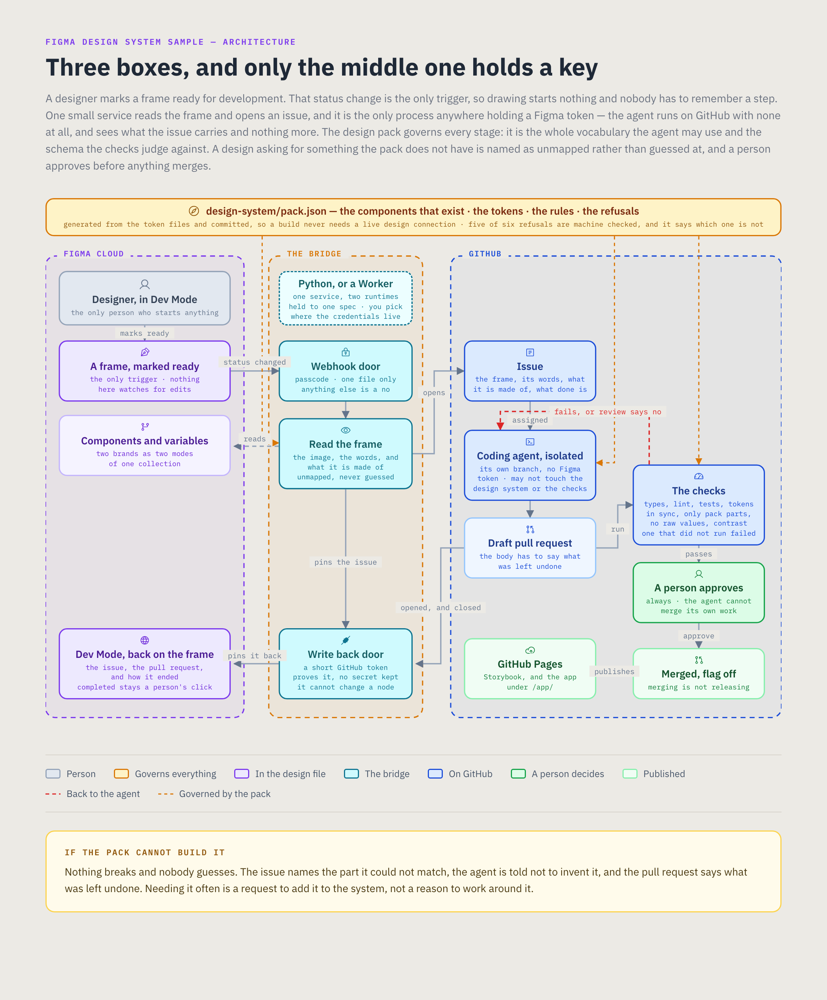

# figma-design-system-sample

A designer marks a frame ready for development. A few seconds later there is an issue carrying
that frame, the words in it, and the components it is made of. An agent builds it against a
design system it can be held to, opens a pull request, and the checks decide whether it obeyed.
A person approves. The pull request appears back on the frame in Dev Mode, and the change merges
behind a flag that is off.

The integration is the small part. Figma built the event, the read and the link back. GitHub
built the agent, the sandbox and the review. The bridge between them is about four hundred lines
and there is no reason for it to be larger.

The work is everything else: making a design system into something a machine can hold a builder
to, and deciding who is allowed to change what.



## See it

| | |
|---|---|
| The design file | https://www.figma.com/design/IDVXk0yZaJ1CQvIZn14AkA/figma-design-system-sample |
| The diagram above | `docs/architecture.html`, which renders the PNG |
| Storybook | published from `main` to GitHub Pages |
| The application | the same, under `/app/` |

The Figma file opens on a cover that says what it is. `How this works` is the page worth reading:
six steps, and what happens when a design asks for something the system does not have.

## What is here

| | |
|---|---|
| `design-system/` | Three token tiers, two brands, and the build that turns them into stylesheets and into `pack.json` |
| `src/` | Six components, the pack as code, and a small page that uses them |
| `scripts/` | The two checks: the source against the pack, and the pull request body against its contract |
| `bridge/` | The service between a Figma webhook and a GitHub issue, in Python, on a machine you control |
| `worker/` | The same service, in TypeScript, on Cloudflare, with nothing to operate |
| `contract/` | The spec both of them are held to: the behaviour table and the exact issue body |
| `figma/` | What the Figma file has to contain, and the component key map |
| `SETUP.md` | Tokens, scopes, storage, and the one step that fails quietly |
| `docs/` | The runbook, the diagram, what Figma can actually do, how this is run, what is left, and what each decision cost |

Two runtimes, one spec. The only part of this system that has to run somewhere is the translating
service, and it is deliberately available both ways: on hardware you own, where every credential
stays in your keychain, or on Cloudflare, where there is nothing to operate and the credentials do
not. `contract/` is what stops those two from becoming two systems. `SETUP.md` has the table to
choose from.

## The design system is a contract

Three tiers, and the tier rule is enforced by the compiler rather than by review.

**Primitive** values are raw and are never emitted as custom properties, so nothing downstream
can reach past the semantic tier even if it wants to.

**Semantic** is the only tier a brand may edit, and every brand declares the identical key set.
A brand that drops a key, invents one, or sets a component-tier value does not compile.

**Component** resolves from semantic only, so it compiles once for every brand. That is the
proof that a brand cannot fork a component: there is one component stylesheet and it contains no
brand's values at all.

A brand also has to be legible. Every pairing the system puts on screen is declared in
`pack.meta.json` and measured at build time, text at 4.5 to 1 and structure at 3 to 1. A brand
that fails one is a build failure rather than an accessibility finding six months later. The gate
earned itself the day it was written, on a control border neither brand had ever had checked.

## What the agent is handed

`design-system/pack.json`. The components that exist, their props and their tokens, every token
with its meaning, the rules, and the refusals. If it is not in there it does not exist here.

The pack also says which check enforces each refusal, and says plainly that one of the six needs
a person. A rule that claims a machine checks it when none does is worse than a rule that admits
it needs review, because the first thing anyone does with a compliance story is ask what
enforces it.

## What the checks do

```
pnpm test:all
```

Types, lint, the pack in sync with its sources, the source against the pack, and the tests.
`check-contract` refuses a raw colour, length or duration, a component from outside the pack,
anything in `src/components` the pack does not list, a component helping itself to the accent,
motion with no reduced-motion guard, and any pack component without a story and a test.

It exits 1 when the code is wrong and 2 when the check could not run. Continuous integration
fails on both, so a check that did not run is never reported as a check that passed.

Sixty nine tests, and most of the ones worth reading break the repository on purpose to watch a
check refuse it.

## Running it

```
pnpm install
pnpm pack          # build the design pack from the token files
pnpm storybook     # the components, with a brand switcher
pnpm dev           # the page that uses them
pnpm test:all      # the gate, the same one the pull request runs
```

Three suites, because there are three things to be wrong: the application, the Worker, and the
Python service. Each mirrors one continuous integration job exactly, and `pnpm test:everything`
runs all three, so nothing is discoverable only by pushing.

```
pnpm test:all          # types, lint, the pack, the contract, 95 tests
pnpm test:worker       # types and 24 tests, in workerd
pnpm test:bridge       # ruff, the format check, and 42 tests
pnpm test:everything   # all three
```

**`SETUP.md` is the configuration guide**: the tokens, their scopes, where each one is stored, and
what holds which credential. It starts with the choice between the two runtimes, because that is
the decision that cannot be reversed later without rotating tokens. `docs/RUNBOOK.md` is the
ordered list of what a person has to do. Each runtime has its own instructions in
`bridge/README.md` and `worker/README.md`.

The Figma file lives at `figma/FILE.md`, with its key recorded there. The components carry keys
whether or not the library is published, so the key sync reads the file rather than the published
library and there is no publish step.

The demo is meant to be run more than once:

```
pnpm demo:status    # what state the loop is in right now
pnpm demo:reset     # put Figma and the repository back
```

Reset unpins the dev resources, deletes the comments the bridge left, and closes the issues and
pull requests a run produced. It does not touch the components, the frames or anything merged.
The one step it cannot do is set a frame's dev status back, because Figma's REST surface cannot
set one, and that is the right place for that line.

## What this gives up

`docs/DECISIONS.md`, which names the cost of every choice here: one gate instead of five, two
brands instead of seventeen, two bridge runtimes and what holding them to one spec costs, an
advisory visual check, and a fence around the components directory that stops an accident rather
than a determined person.
